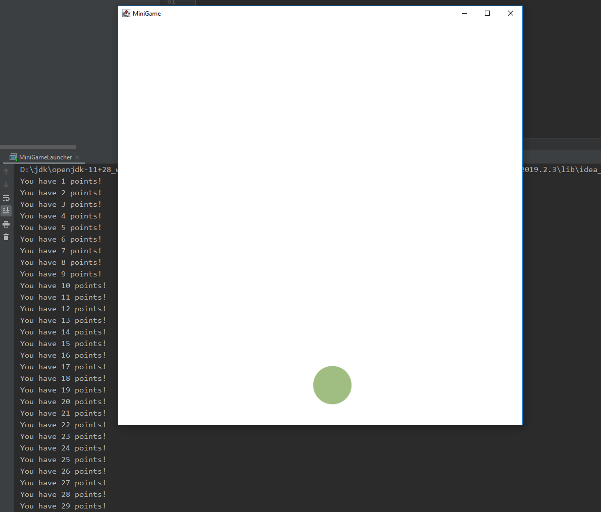

# U21 | Minigame mit Mausklick

Erstellen Sie ein kleines Reaktionsspiel. Ziel des Spiels ist es, einen
Ball, der sich innerhalb der Grenzen des Fensters linear bewegt, mit der
Maus zu treffen. Berührt der Ball eine der Seiten, prallt er von der
Wand ab. Schafft es die spielende Person, den Ball mit der Maus zu treffen, erhöht sich die Geschwindigkeit des Balls, er wechselt die Richtung und man bekommt einen Punkt. Beim Richtungswechsel werden x- und y-Richtung getauscht. Wird alles zuviel, sollen Spielende mit einem Druck auf Escape den Ball zum Stillstand bringen können. Dabei setzt sich auch der Punktestand wieder auf 0 zurück.

In der `GraphicsApp`-Anwendung `MiniGame` müssen Sie den Spielgegenstand, einen `ClickBall`, instanziieren und Mausklicks mit der `onMousePressed`-Methode auf ihn behandeln sowie Punkte zählen. Auch die Behandlung des `KeyPressedEvents` und die Abfage, ob Escape gedrückt wurde, gilt es hier zu erledigen. Geben Sie den aktuellen Punktestand auf der Konsole aus, wenn er sich verändert.

In der Klasse `ClickBall` sind einige Methoden bereits vorgegeben, die Ihnen aus der RandomBouncingBalls-Übung bekannt sein dürften. Zusätzlich implementieren sollen Sie den Richtungswechsel, das Stoppen und die Abfrage, ob der Ball vom Klick getroffen wurde.

